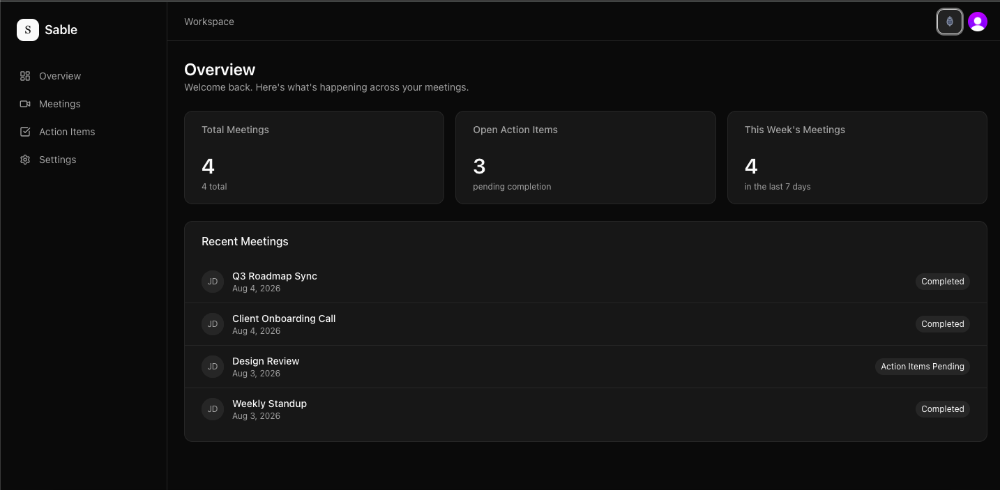

 

**Sable transcribes, summarizes, and tracks action items from your meetings automatically so nothing important gets lost again.**

 

 

## ✨ Features

- 🔐 **Real authentication** — Clerk-powered sign-in/sign-out with protected routes and just-in-time user sync
- 🗄️ **Real database** — PostgreSQL via Prisma with proper relational schema (Users, Meetings, Action Items)
- 🤖 **Ask AI** — content-aware Q&A over meeting transcripts with a real streaming architecture
- 📋 **Action Items kanban** — commitments tracked automatically across To Do / In Progress / Done
- 📝 **Editable profile** — React Hook Form + Zod validation with a real Server Action write path
- 🌗 **Dark mode** — a custom hand-built lantern icon toggle with next-themes persistence
- 📱 **Fully responsive** — mobile drawer navigation with proper accessibility semantics
- 🎬 **Framer Motion** — subtle entrance and stagger animations across the marketing page and dashboard

## 🧱 Tech Stack

| Layer | Technology |
|---|---|
| Framework | Next.js 14 (App Router) |
| Language | TypeScript |
| Styling | Tailwind CSS + shadcn/ui (Radix UI) |
| Auth | Clerk |
| Database | PostgreSQL (Neon) + Prisma 7 |
| Validation | Zod + React Hook Form |
| Animation | Framer Motion |
| Deployment | Vercel |

## 📁 Folder Structure

    src/
      app/
        (marketing)/       -> public landing page, served at "/"
        (dashboard)/        -> authenticated app shell
          dashboard/         -> overview page
          meetings/           -> meetings list + "/meetings/[id]" detail with Ask AI
          actions/            -> action items kanban
          settings/           -> profile settings with real validation
        api/
          meetings/[id]/ask/  -> streaming Q&A endpoint
        layout.tsx
        globals.css
      components/
        ui/                 -> shadcn/ui primitives
        lantern-toggle.tsx  -> custom dark mode toggle
        logo.tsx
      lib/
        prisma.ts           -> Prisma client singleton
    prisma/
      schema.prisma
      seed.ts

## 🚀 Local Setup

    git clone https://github.com/hafsasiddiqa/Sable.git
    cd sable
    npm install
    npx prisma migrate dev
    npx tsx prisma/seed.ts
    npm run dev

Visit `http://localhost:3000`.

You'll also need a `.env.local` with `DATABASE_URL`, `CLERK_SECRET_KEY`, and `NEXT_PUBLIC_CLERK_PUBLISHABLE_KEY`.

## 🏗️ Build

    npm run build

## 🗺️ Roadmap

- [x] Deploy to Vercel
- [x] Auth (Clerk)
- [x] Real database (Prisma + Neon)
- [x] Ask AI with streaming architecture
- [x] Dark mode
- [x] Framer Motion polish
- [ ] Automated test suite (Vitest + Playwright)
- [ ] Real LLM integration (Anthropic API, currently keyword-matched)
- [ ] Semantic search across meetings
- [ ] Team/workspace roles

## 👤 Author

Built as a self-directed portfolio project demonstrating production-level frontend engineering: real auth, a relational database, streaming architecture, and thoughtful UI polish.

 
Built with care, one verified step at a time.

